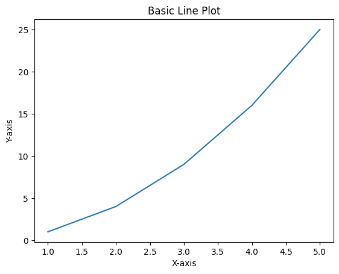
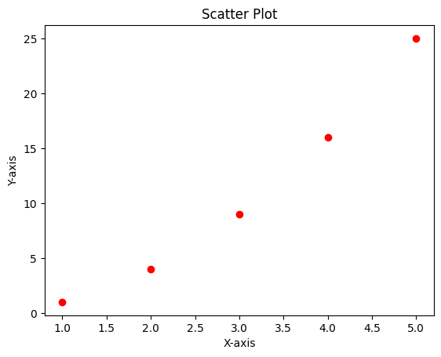
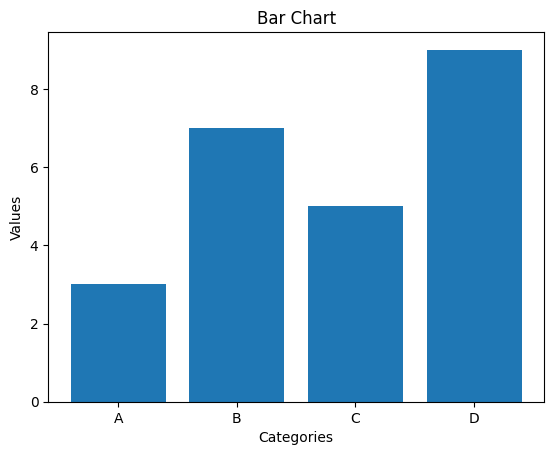
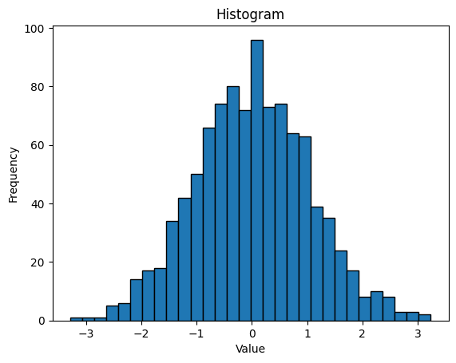
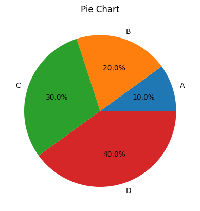
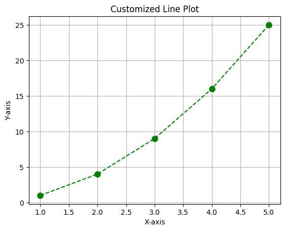
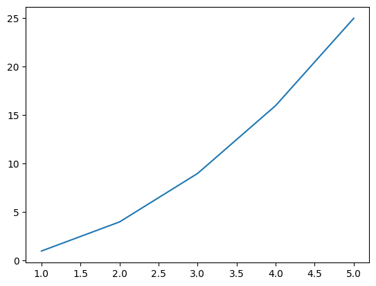

# Program 1 : Ways to read and write data in a file

**Part 1**: Writing to Files


```python
# 1. Writing to a file using write mode ('w')
with open('sample1.txt', 'w') as file:
    file.write("Hello, this is Aakash with Roll No.: 2211002\n")
    file.write("Jack Sparrow : Call me Captain Savyyy.\n")
    file.write("ExCommunicado - John Wick\n")

print("\nsample1.txt created with initial content\n")

# 2. Writing multiple lines at once using writelines()
lines = [
    "Mahool pura wavyy\n",
    "B.Tech Aiml 6th Sem\n",
    "<--.|.-->\n"
]

with open('sample2.txt', 'w') as file:
    file.writelines(lines)

print("sample2.txt created with multiple lines")
```

    
    sample1.txt created with initial content
    
    sample2.txt created with multiple lines


**Part 2**: Reading from Files


```python
# 4. Reading entire content at once
print("\nReading entire content of sample1.txt:")
with open('sample1.txt', 'r') as file:
    content = file.read()
    print(content)

# 5. Reading line by line
print("\nReading sample2.txt line by line:")
with open('sample2.txt', 'r') as file:
    for line in file:
        print(line.strip())
```

    
    Reading entire content of sample1.txt:
    Hello, this is Aakash with Roll No.: 2211002
    Jack Sparrow : Call me Captain Savyyy.
    ExCommunicado - John Wick
    
    
    Reading sample2.txt line by line:
    Mahool pura wavyy
    B.Tech Aiml 6th Sem
    <--.|.-->


# Program 2 : Illustrate use of Append mode

  Appending to a file ('a' mode)


```python
with open('sample1.txt', 'a') as file:
    file.write("Appended line 1\n")
    file.write("Appended line 2\n")
    file.write("Appended line 3\n")

print("Content appended to sample1.txt")
```

    Content appended to sample1.txt


Reading all lines from file


```python
print("\nReading all lines from sample1.txt into a list:")
with open('sample1.txt', 'r') as file:
    lines = file.readlines()
    for i, line in enumerate(lines, 1):
        print(f"Line {i}: {line.strip()}")
```

    
    Reading all lines from sample1.txt into a list:
    Line 1: Hello, this is Aakash with Roll No.: 2211002
    Line 2: Jack Sparrow : Call me Captain Savyyy.
    Line 3: ExCommunicado - John Wick
    Line 4: Appended line 1
    Line 5: Appended line 2
    Line 6: Appended line 3


# Program 3 : Bubble Sort


```python
def bubble_sort(arr):
    n = len(arr)

    for i in range(n):
        for j in range(0, n-i-1):
            if arr[j] > arr[j+1]:
                arr[j], arr[j+1] = arr[j+1], arr[j]

    return arr
```


```python
numbers = [27, 7, 25, 12, 77, 2, 90]
names = ["Aakash", "Jack", "Sparrow", "Jardani \"Jonathan\" Jovanovich", "John Snow","Anirudh"]

print("Original numbers:", numbers)
sorted_numbers = bubble_sort(numbers.copy())
print("Sorted numbers:", sorted_numbers)

print("\nOriginal names:", names)
sorted_names = bubble_sort(names.copy())
print("Sorted names:", sorted_names)
```

    Original numbers: [27, 7, 25, 12, 77, 2, 90]
    Sorted numbers: [2, 7, 12, 25, 27, 77, 90]
    
    Original names: ['Aakash', 'Jack', 'Sparrow', 'Jardani "Jonathan" Jovanovich', 'John Snow', 'Anirudh']
    Sorted names: ['Aakash', 'Anirudh', 'Jack', 'Jardani "Jonathan" Jovanovich', 'John Snow', 'Sparrow']


# Program 4 : Selection Sort Algorithm


```python
def selection_sort(arr):
    n = len(arr)

    for i in range(n):
        min_id = i
        for j in range(i+1, n):
            if arr[j] < arr[min_id]:
                min_id = j

        # Swap minimum with first element
        arr[i], arr[min_id] = arr[min_id], arr[i]

    return arr
```


```python
numbers = [27, 7, 25, 12, 77, 2, 90]
names = ["Aakash", "Jack", "Sparrow", "Jardani \"Jonathan\" Jovanovich", "John Snow"]

print("Original numbers:", numbers)
sorted_numbers = selection_sort(numbers.copy())
print("Sorted numbers:", sorted_numbers)

print("\nOriginal names:", names)
sorted_names = selection_sort(names.copy())
print("Sorted names:", sorted_names)
```

    Original numbers: [27, 7, 25, 12, 77, 2, 90]
    Sorted numbers: [2, 7, 12, 25, 27, 77, 90]
    
    Original names: ['Aakash', 'Jack', 'Sparrow', 'Jardani "Jonathan" Jovanovich', 'John Snow']
    Sorted names: ['Aakash', 'Jack', 'Jardani "Jonathan" Jovanovich', 'John Snow', 'Sparrow']


# Program 5 : Merge Sort Algorithm


```python
def merge_sort(arr):
    if len(arr) > 1:
        mid = len(arr) // 2

        left_half = arr[:mid]
        right_half = arr[mid:]

        merge_sort(left_half)
        merge_sort(right_half)

        # COmbine both sorted halves
        i = j = k = 0

        while i < len(left_half) and j < len(right_half):
            if left_half[i] < right_half[j]:
                arr[k] = left_half[i]
                i += 1
            else:
                arr[k] = right_half[j]
                j += 1
            k += 1
        while i < len(left_half):
            arr[k] = left_half[i]
            i += 1
            k += 1
        while j < len(right_half):
            arr[k] = right_half[j]
            j += 1
            k += 1

    return arr
```


```python
numbers = [27, 7, 25, 12, 77, 2, 90]
names = ["Aakash", "Jack", "Sparrow", "Jardani \"Jonathan\" Jovanovich", "John Snow"]
ids = [2211002, 272727, 100007, 987654, 989898]

print("Original numbers:", numbers)
sorted_numbers = merge_sort(numbers.copy())
print("Sorted numbers:", sorted_numbers)

print("\nOriginal names:", names)
sorted_names = merge_sort(names.copy())
print("Sorted names:", sorted_names)

print("\nOriginal IDs:", ids)
sorted_ids = merge_sort(ids.copy())
print("Sorted IDs:", sorted_ids)
```

    Original numbers: [27, 7, 25, 12, 77, 2, 90]
    Sorted numbers: [2, 7, 12, 25, 27, 77, 90]
    
    Original names: ['Aakash', 'Jack', 'Sparrow', 'Jardani "Jonathan" Jovanovich', 'John Snow']
    Sorted names: ['Aakash', 'Jack', 'Jardani "Jonathan" Jovanovich', 'John Snow', 'Sparrow']
    
    Original IDs: [2211002, 272727, 100007, 987654, 989898]
    Sorted IDs: [100007, 272727, 987654, 989898, 2211002]


# Program 6 : Quick Sort Algorithm


```python
def partition(array, low, high):
    # choose the rightmost element as pivot
    pivot = array[high]

    # pointer for greater element
    i = low - 1
    for j in range(low, high):
        if array[j] <= pivot:
            i = i + 1
            (array[i], array[j]) = (array[j], array[i])

    (array[i + 1], array[high]) = (array[high], array[i + 1])
    return i + 1

def quick_sort(array, low=0, high=None):
    if high is None:
        high = len(array) - 1
    if low < high:
        pi = partition(array, low, high)
        quick_sort(array, low, pi - 1)
        quick_sort(array, pi + 1, high)
    return array
```


```python
numbers = [27, 7, 25, 12, 77, 2, 90]
names = ["Aakash", "Jack", "Sparrow", "Jardani \"Jonathan\" Jovanovich", "John Snow"]

print("Original numbers :", numbers)
print("Sorted numbers :", quick_sort(numbers.copy()))

print("\nOriginal names :", names)
print("Sorted names :", quick_sort(names.copy()))

```

    Original numbers : [27, 7, 25, 12, 77, 2, 90]
    Sorted numbers : [2, 7, 12, 25, 27, 77, 90]
    
    Original names : ['Aakash', 'Jack', 'Sparrow', 'Jardani "Jonathan" Jovanovich', 'John Snow']
    Sorted names : ['Aakash', 'Jack', 'Jardani "Jonathan" Jovanovich', 'John Snow', 'Sparrow']


# Program 7 :  Statistics


```python
import math
from collections import Counter
```


```python
from collections import Counter
import math

def calculate_mean(data):
    return sum(data) / len(data)

def calculate_median(data):
    sorted_data = sorted(data)
    n = len(sorted_data)
    if n % 2 == 1:
        return sorted_data[n // 2]
    else:
        return (sorted_data[n // 2 - 1] + sorted_data[n // 2]) / 2

def calculate_mode(data):
    counts = Counter(data)
    max_count = max(counts.values())
    modes = [k for k, v in counts.items() if v == max_count]
    return sorted(modes)  # Return sorted list of all modes

def calculate_variance(data, sample=True):
    mean = sum(data) / len(data)
    n = len(data)
    temp_var = 0.0

    if sample and n > 1:
        for x in data:
            temp_var += (x - mean) ** 2
        var = temp_var / (n - 1)
    else:
        for x in data:
            temp_var += (x - mean) ** 2
        var = temp_var / n
    return var

def calculate_std_dev(data, sample=True):
    return math.sqrt(calculate_variance(data, sample))

def calculate_summary_statistics(data):
    stats = {
        'mean': calculate_mean(data),
        'median': calculate_median(data),
        'mode': calculate_mode(data),
        'variance': calculate_variance(data),
        'standard_deviation': calculate_std_dev(data),
        'sample_size': len(data),
        'minimum': min(data),
        'maximum': max(data),
        'range': max(data) - min(data)
    }
    return stats

def print_statistics(stats):
    print("\nSummary Statistics:")
    print(f"Mean: {stats['mean']:.4f}")
    print(f"Median: {stats['median']:.4f}")
    print(f"Mode(s): {', '.join(map(str, stats['mode']))}")
    print(f"Variance: {stats['variance']:.4f}")
    print(f"Standard Deviation: {stats['standard_deviation']:.4f}")
    print(f"Sample Size: {stats['sample_size']}")
    print(f"Minimum: {stats['minimum']}")
    print(f"Maximum: {stats['maximum']}")
    print(f"Range: {stats['range']}")
```


```python
# Numeric data examples
numbers = [27, 7, 25, 12, 77, 2, 90, 12, 25, 12,7,7]
student_ids = [2211002, 272727, 100007, 987654, 989898, 2211002]

# Calculate statistics
numbers_stats = calculate_summary_statistics(numbers)
ids_stats = calculate_summary_statistics(student_ids)

# Print results
print("For numbers data:", numbers)
print_statistics(numbers_stats)

print("\nFor student IDs data:", student_ids)
print_statistics(ids_stats)
```

    For numbers data: [27, 7, 25, 12, 77, 2, 90, 12, 25, 12, 7, 7]
    
    Summary Statistics:
    Mean: 25.2500
    Median: 12.0000
    Mode(s): 7, 12
    Variance: 812.7500
    Standard Deviation: 28.5088
    Sample Size: 12
    Minimum: 2
    Maximum: 90
    Range: 88
    
    For student IDs data: [2211002, 272727, 100007, 987654, 989898, 2211002]
    
    Summary Statistics:
    Mean: 1128715.0000
    Median: 988776.0000
    Mode(s): 2211002
    Variance: 834562854271.2000
    Standard Deviation: 913544.1173
    Sample Size: 6
    Minimum: 100007
    Maximum: 2211002
    Range: 2110995


# Program 10 : Matplotlib


```python
import matplotlib.pyplot as plt
```

**1. Line Plot**


```python
# Data
x = [1, 2, 3, 4, 5]
y = [1, 4, 9, 16, 25]

# Create a line plot
plt.plot(x, y)

# Add labels and title
plt.xlabel('X-axis')
plt.ylabel('Y-axis')
plt.title('Basic Line Plot')

# Show the plot
plt.show()
```


    

    


**2. Scatter Plot**


```python
# Data
x = [1, 2, 3, 4, 5]
y = [1, 4, 9, 16, 25]

# Create a scatter plot
plt.scatter(x, y, color='red')

# Add labels and title
plt.xlabel('X-axis')
plt.ylabel('Y-axis')
plt.title('Scatter Plot')

# Show the plot
plt.show()
```


    

    


**3. Bar Chart**


```python
# Data
categories = ['A', 'B', 'C', 'D']
values = [3, 7, 5, 9]

# Create a bar chart
plt.bar(categories, values)

# Add labels and title
plt.xlabel('Categories')
plt.ylabel('Values')
plt.title('Bar Chart')

# Show the plot
plt.show()
```


    

    


**4. Histogram**


```python
import numpy as np

# Data: 1000 random numbers from a normal distribution
data = np.random.randn(1000)

# Create a histogram
plt.hist(data, bins=30, edgecolor='black')

# Add labels and title
plt.xlabel('Value')
plt.ylabel('Frequency')
plt.title('Histogram')

# Show the plot
plt.show()
```


    

    


**5. Pie Chart**


```python
# Data
sizes = [10, 20, 30, 40]
labels = ['A', 'B', 'C', 'D']

# Create a pie chart
plt.pie(sizes, labels=labels, autopct='%1.1f%%')

# Title
plt.title('Pie Chart')

# Show the plot
plt.show()
```


    

    


**6. Customizing Plots**


```python
# Data
x = [1, 2, 3, 4, 5]
y = [1, 4, 9, 16, 25]

# Customizing plot style
plt.plot(x, y, color='green', linestyle='--', marker='o', markersize=8)

# Add labels and title
plt.xlabel('X-axis')
plt.ylabel('Y-axis')
plt.title('Customized Line Plot')

plt.grid(True)

# Show the plot
plt.show()
```


    

    


**7. Saving Plots**


```python
# Create a simple plot
plt.plot(x, y)

# Save the plot as a PNG file
plt.savefig('plot.png')

# Show the plot
plt.show()
```


    

    

